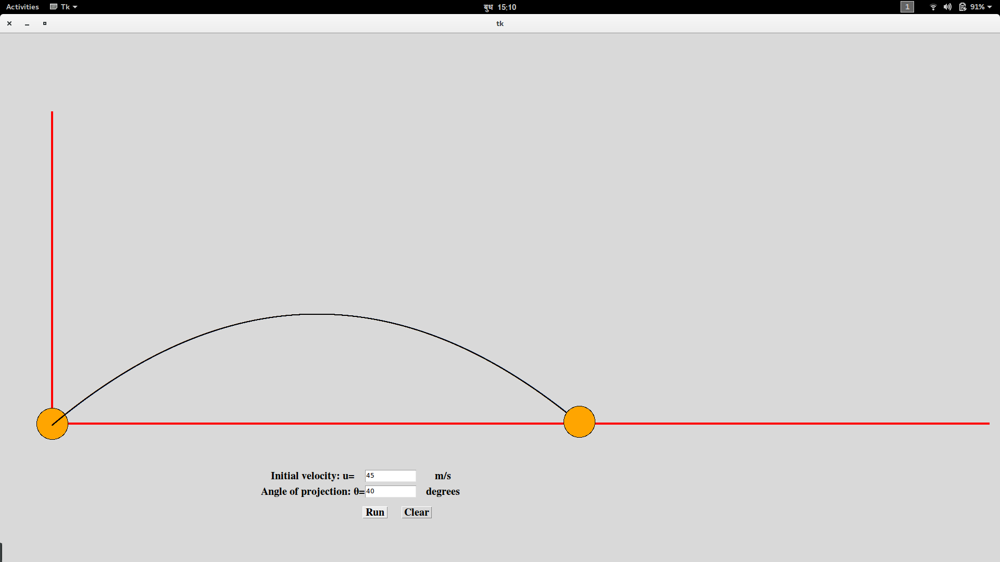

# Projectile-Simulation-Graphics
A python program that takes inputs from user and simulates projectile motion using Tkinter graphics library in Python

## Graphics Library used
Tkinter 

## How to run
Just intall Tkinter and run project.py, give the required inputs and press run button

## Screenshots

